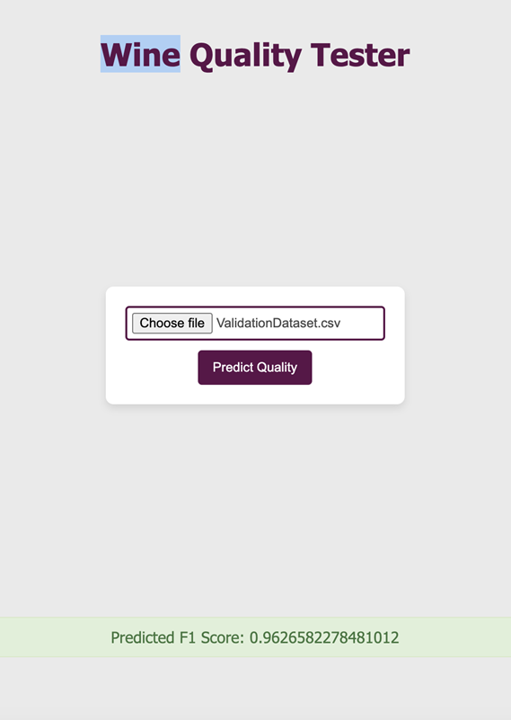

Beverage Quality Assessment Using Apache Spark and Flintrock
Table of Contents:
●	Introduction
●	System Configuration and Installation
●	Conducting the Training Process
●	Setting Up the Prediction Interface
Introduction
	This guide presents a structured approach to constructing a Spark cluster utilizing Flintrock, focusing on the analysis of beverage quality. The process involves leveraging a pre-built model for analytical purposes and deploying the findings via Docker.
System Configuration and Installation
1. Flintrock Installation
Begin by confirming the installation of Python 3. Then, proceed with the following commands for Flintrock installation:
sudo yum install python3-pip -y
sudo yum install git -y
pip3 install
2. AWS Environment Setup
Configure your EC2 instance with AWS credentials using aws configure, based on the AWS Lab guidelines.

3. Preparing Flintrock Environment
Before creating the cluster, ensure you have a valid .pem file for accessing EC2 instances. The steps include:
●	Transfer the .pem file to your EC2 instance.
●	Run flintrock configure to produce a .config/flintrock/config.yaml file.
●	Edit the .config/flintrock/config.yaml file to include the .pem file path, key-name, identity-file, ami, and set the slave count to 4.
4. Initiating Cluster with Flintrock
Start your cluster using Flintrock:
flintrock launch spark-cluster
5. Transferring Data to the Cluster
Move the training data (TrainingDataset.csv) to the cluster:
flintrock copy-file spark-cluster TrainingDataset.csv /home/ec2-user/
6. Cluster Access
Log into the master node:
flintrock login spark-cluster
7. Installing Necessary Libraries
Within the cluster, install required libraries:
pip3 install numpy
sudo yum install git
8. Cloning the Repository
Clone the specified repository:
git clone https://github.com/srujit12091997/EC2Wine-Parallel-Wine-Quality-Engine
cd assignment2

Conducting the Training Process
1. Master Node IP Retrieval
From the AWS EC2 console, obtain the Public IP of the master node.

2. Training on the Cluster
Commence the training on the 4-worker cluster:
spark-submit --master spark://PublicIP:7077 train.py

Setting Up the Prediction Interface

1. Docker Installation on Cluster
Follow these steps for Docker installation:
sudo yum install docker
sudo systemctl restart docker
sudo usermod -aG docker $USER

2. Docker Container Configuration and Deployment
Pull the Docker container for the assessment service:
docker pull saiganesh2431/flaskapp:latest

Run the container on the master node:
docker run -v /home/ec2-user/spark:/home/ec2-user/spark -p 5000:5000 saiganesh2431/flaskapp:latest

3. Local HTML File Modification
Update your HTML file to redirect requests to the Docker endpoint: http://[PublicIP]:5000/predict

4. Inbound Security Rule Creation
Set up an inbound security rule on the AWS EC2 console for the master node to allow traffic on port 5000.

5. F1 Score Display
Upon submitting the validation CSV in the browser, the Docker service will showcase the assessment results and the F1 score.
 
